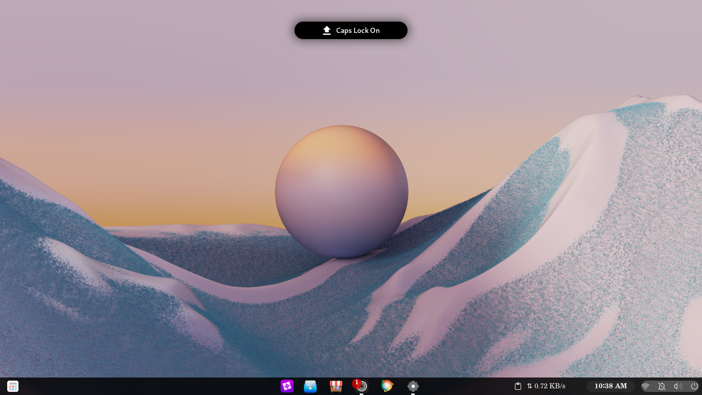
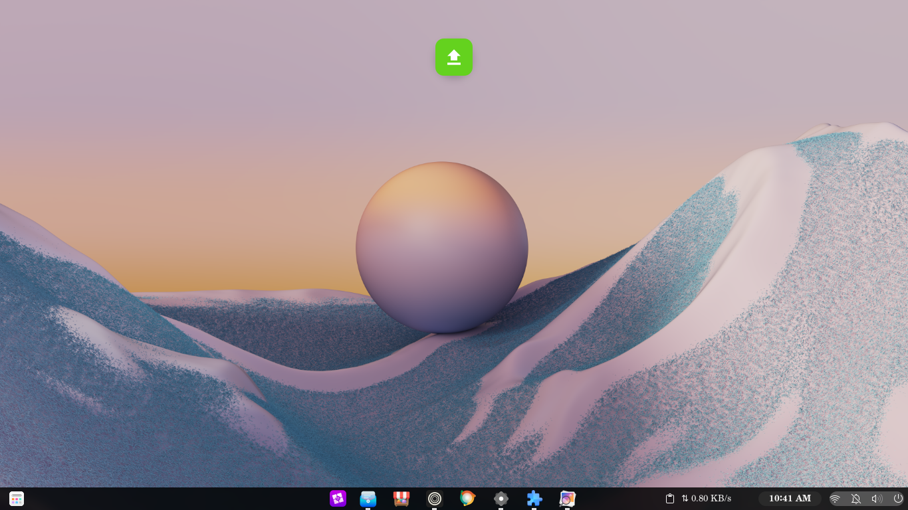
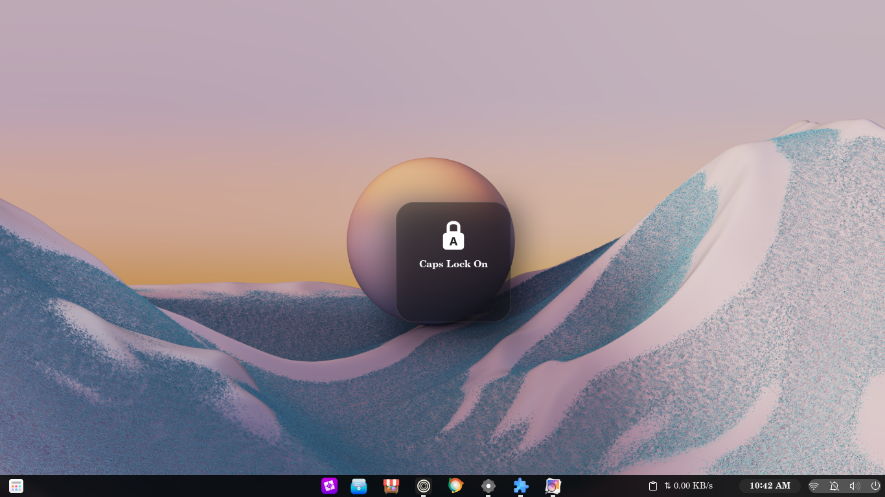
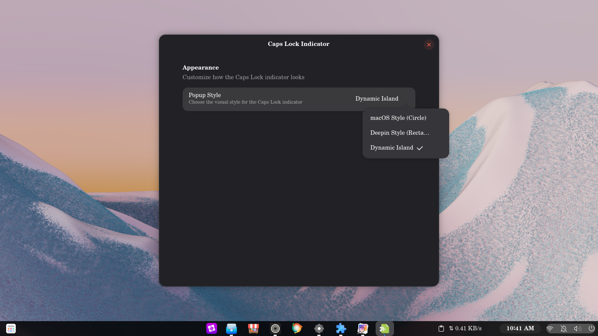

# Caps Lock Indicator

A lightweight GNOME Shell extension that shows a beautiful animated popup every time you toggle Caps Lock. Three visual styles, smooth animations, automatic light/dark theme support — and zero persistent UI.

---

## Preview

### ⚫ Dynamic Island — Morphing Pill


A black pill at the top-center that morphs open to reveal content, then collapses and fades away.

---

### 🟢 macOS — Circle


A minimal circle at the top-center of your screen. Icon only, no text.

---

### 🟫 Deepin — Rectangle


A large rounded rectangle center-screen with icon and label.

---

### ⚙️ Preferences


Switch styles instantly from the preferences window — no restart needed.

---

## Styles

### ⚫ Dynamic Island
Inspired by Apple's Dynamic Island on iPhone 14 Pro. A black pill at the top-center of your screen that **morphs** from a collapsed state into an expanded pill showing icon + text, then collapses and fades out.

- Position: top-center, just below the panel
- Shape: morphs from `120px` collapsed pill → `220px` expanded pill
- Content: icon + `"Caps Lock On"` / `"Caps Lock Off"`
- Animation: 4-phase morph with chained Clutter easing
- Theme: always black

### 🔵 macOS — Circle
Inspired by macOS's clean system indicators. A small minimal circle — icon only, no text — that appears and disappears quietly.

- Position: top-center, just below the panel
- Shape: 56px circle
- Animation: scale + fade, 150ms `EASE_OUT_BACK`
- Theme: follows system light/dark

### ⬛ Deepin — Rectangle
Inspired by Deepin Linux's notification style. A large rounded rectangle in the center of your screen with icon and label.

- Position: center of screen
- Shape: rounded rectangle with icon + label
- Content: icon + `"Caps Lock On"` / `"Caps Lock Off"`
- Animation: scale + fade, 200ms `EASE_OUT_QUAD`
- Theme: follows system light/dark

---

## Features

- ✅ Three switchable popup styles
- ✅ Smooth Clutter animations on every style
- ✅ Automatic light/dark theme support (macOS + Deepin styles)
- ✅ Style changes take effect on next toggle — no restart needed
- ✅ Rapid-toggle safe — no ghost popups, no crashes
- ✅ Zero persistent panel icon
- ✅ Full resource cleanup on disable
- ✅ Multi-monitor aware

---

## Requirements

| Requirement | Version |
|---|---|
| GNOME Shell | 45, 46, 47, 48, 49, 50 |
| GJS | ESM-capable (ships with GNOME 45+) |
| Distribution | Any (Fedora, Ubuntu, Arch, etc.) |

---

## Installation

### Option A — Manual (recommended)

```bash
# 1. Download and extract
unzip capslock-indicator@user.zip
cd capslock-indicator@user

# 2. Run the installer
bash install.sh

# 3. Reload GNOME Shell
#    Wayland: log out and log back in
#    X11:     Alt+F2 → type r → Enter

# 4. Enable the extension
gnome-extensions enable capslock-indicator@user
```

### Option B — Manual copy

```bash
EXT_DIR="$HOME/.local/share/gnome-shell/extensions/capslock-indicator@user"
mkdir -p "$EXT_DIR/schemas"

cp metadata.json extension.js prefs.js stylesheet.css "$EXT_DIR/"
cp schemas/*.xml "$EXT_DIR/schemas/"

glib-compile-schemas "$EXT_DIR/schemas/"
gnome-extensions enable capslock-indicator@user
```

---

## Preferences

Open the style switcher at any time:

```bash
gnome-extensions prefs capslock-indicator@user
```

Or via **GNOME Extensions** app → Caps Lock Indicator → Settings.

Choose between:
- `macOS Style (Circle)`
- `Deepin Style (Rectangle)`
- `Dynamic Island Style`

The change takes effect on your next Caps Lock press.

---

## File Structure

```
capslock-indicator@user/
├── extension.js          ← Main logic, all three popup styles
├── prefs.js              ← Preferences UI (Adw-based)
├── metadata.json         ← Extension metadata
├── stylesheet.css        ← All visual styles
├── install.sh            ← One-shot installer
├── screenshots/          ← Preview images
└── schemas/
    └── org.gnome.shell.extensions.capslock-indicator.gschema.xml
```

---

## Debugging

**Popup doesn't appear:**
```bash
# Check extension status
gnome-extensions info capslock-indicator@user

# Watch live logs
journalctl -f /usr/bin/gnome-shell | grep -i "capslock\|error"
```

**Preferences window errors:**
```bash
# Recompile schema (fixes most prefs errors)
glib-compile-schemas ~/.local/share/gnome-shell/extensions/capslock-indicator@user/schemas/
```

**Test in a nested session (Wayland — no logout needed):**
```bash
dbus-run-session -- gnome-shell --nested --wayland
```

**Common issues:**

| Symptom | Cause | Fix |
|---|---|---|
| `Extension does not exist` | Not installed yet | Run `install.sh` first |
| `schema_id undefined` error in prefs | Schema not compiled | Run `glib-compile-schemas schemas/` |
| No icon visible in popup | Icon theme missing `input-caps-lock-symbolic` | Install `gnome-icon-theme` or `adwaita-icon-theme` |
| Extension not listed | GNOME version mismatch | Run `gnome-shell --version` and confirm 45–50 |

---

## How It Works

The extension connects to GNOME's keymap `state-changed` signal via:

```js
Clutter.get_default_backend().get_default_seat().get_keymap()
```

On every signal fire it reads `keymap.get_caps_lock_state()`, compares with the previous state, and only triggers a popup if the state actually changed. This prevents false triggers from other modifier key events.

All popups are added to `Main.uiGroup` (the global overlay layer), animated using Clutter's `ease()` API, and destroyed after 2 seconds. No persistent widgets are ever left in the scene graph.

---

## Uninstall

```bash
gnome-extensions disable capslock-indicator@user
rm -rf ~/.local/share/gnome-shell/extensions/capslock-indicator@user
```

Log out and back in to fully clear the extension from memory.

---

## License

GPL-3.0 — see [LICENSE](LICENSE) for details.
